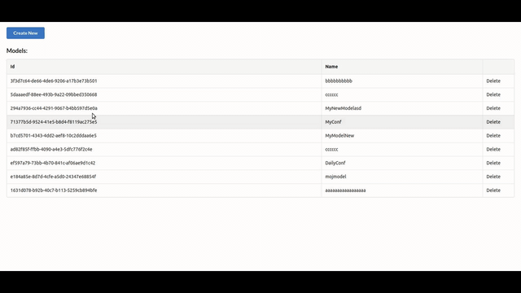
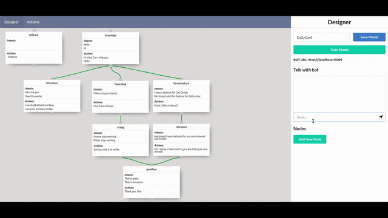

# diagrams2ai (IN DEVELOPMENT)

Simple way of building chatbot by connecting diagram nodes to make a different stories.
Goal is to create easier way for building chatbots without just adding bunch of intents and actions, which can be very complex.

## How it works

You can built, train, run and chat straight away from GUI. It also allows you to have different models built.

### Editing

Diagram nodes represent different intents in your story. Each intent has different actions and this can be all configured in widget editor.



### Interactive chat

Chat is added for testing, but also while you speak it marks current active intent. This helps for debuging your stories.




## Getting Started

These instructions will get you a copy of the project up and running on your local machine for development and testing purposes.

### Prerequisites

This project uses docker for training and running different RASA chatbots
- docker
- redis
- npm or yarn (GUI)
- Go (backend server + action server)

You need to pull out rasa and redis image. 

```
docker pull rasa/rasa
docker pull redis
```

This project uses redis as database also, so you should run it as:

```
docker run -d --name myredis -p 6379:6379 redis-server --appendonly yes
```

And there you Go, you enviroment is ready, now you can fire up backend
server that is built with GO and front end built with ReactJS

### Running

Now you just need to run backend server and web app, that will handle all configurations and starting different bot containers. It is built with GO lang.

Backend server
```
go run main.go
```

GUI
```
cd gui/
yarn install
yarn start
```


## Deployment

This is not for production, but you could use it to built startup Rasa models and then copy paste to your chatbot in production. There you can do additionaly configuration and train with rasa, or you can just use this model as it is.

By default you should see them: 
```
./save/rasa/<id>
```

## Built With

* [RASA](https://rasa.com/) - RASA for training and running chatbots
* [ReactJS](https://reactjs.org/) - The web framework used
* [GO](https://golang.org/) - Go for backend server


## License

This project is licensed under the MIT License - see the [LICENSE.md](LICENSE.md) file for details

